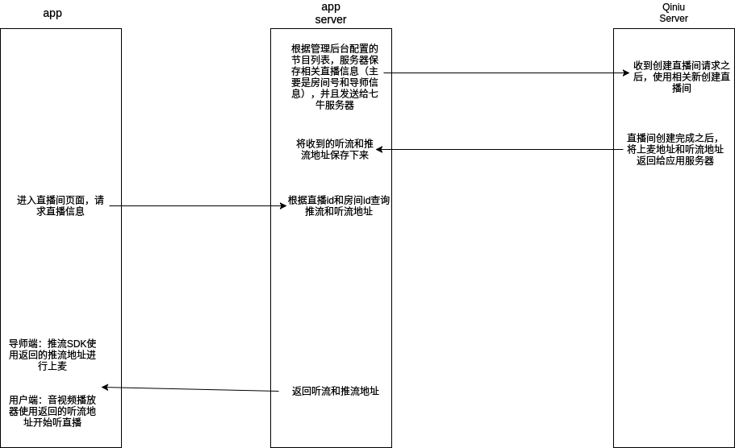
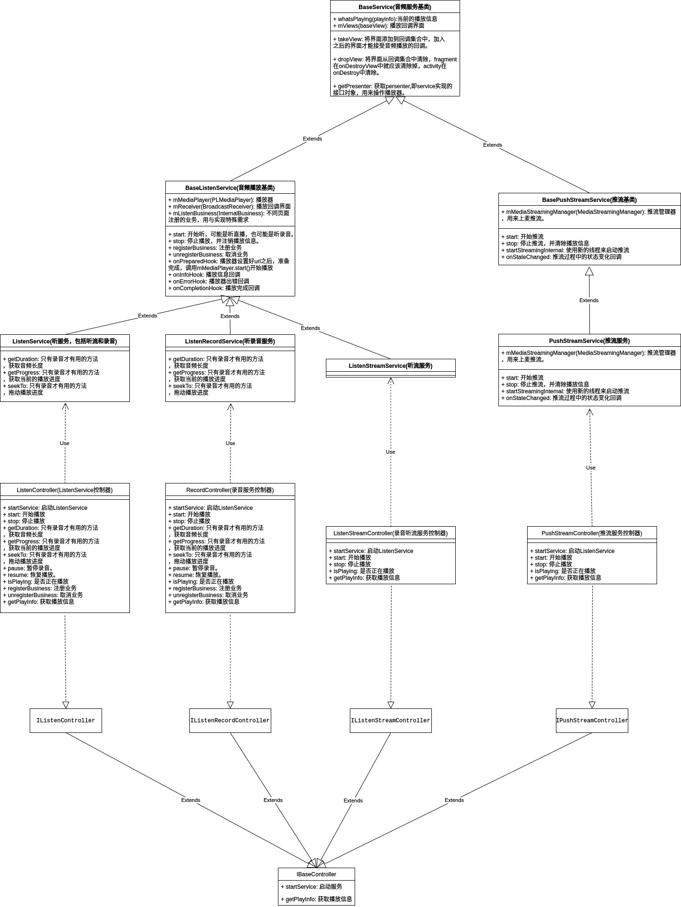

## 七牛音视频框架封装，整体介绍
* 整体框架：架构使用重P的MVP框架设计.所有播放相关逻辑封装在Service(P)里面，需要接入音频服务的界面都应该实现对应的View(V)接口从而被回调。提供音频推流服务，听录音服务，听直播服务和视频播放简单封装。服务使用方式都是通过绑定的方式来进行交互。所有服务的使用方式都是实现对应的
View接口和使用对应的Controller来操作服务。
* 使用到的主要的设计模式
   * 模板方法:BaseService,BaseController等的一些延迟子类操作。
   * 建造者模式:播放信息的链式构建。
   * 策略模式:BaseService已注册View回调的轮循调用操作。
   * 代理模式:BaseService主Service业务代理分发。
* 使用面向接口的编程思想，遵循接口隔离原则，里氏替换原则，单一职责原则，依赖倒置原则和迪米特原则。
* V -> 需要接入音频服务的页面
* P -> 封装了音频服务的各种Service
* M -> 基本都是网络请求数据，也有文件缓存数据，没有做特殊封装。

#### 直播流程，流程按照从上到下的时间先后关系。

* 管理后台配置当天节目单。提供导师信息和房间号给app服务器。
* 服务器根据提供的信息向七牛服务器发起创建直播间的请求。
* 七牛服务器创建好直播间之后返回直播间上麦地址和听流地址给app服务器。app服务器将相应信息（房间号，直播id, 导师信息，推流地址和听流地址等等）全部保存起来。
* 客户端进入应用直播页面之后，根据房间号和直播id请求对应的房间信息：
    * 导师端：使用返回的推流地址，使用七牛sdk进行上麦。
    * 用户端：使用返回的听流地址，使用七牛sdk进行听直播。

#### 音频服务:推流服务，听流服务，听录音服务，音频服务（既可以听直播，也可以听录音）简要介绍，具体看类图。

* BaseService : 这些服务里面的所有基类，保存了当前播放的音频信息，需要回调的界面集合，以及回调界面的注册(takeView)和反注册(dropView)。用来提供所有服务共同的操作和保存共同的信息。
    * BasePushStreamService: 推流基类服务,封装了推流相关的所有基本操作,完成推流的基本框架。客户端继承它来实现完整功能和加入特殊业务。
        * PushStreamService: 推流服务类　-> 扩展推流停止广播。全局异步停止广播。
    * BaseListenService: 音频务基类,封装了听直播和听录音的基本操作。提供各种音频收听回调on****Hook()来扩展业务，这些钩子在注册的回调监听里面调用的空实现方法，通过继承重写，在这些钩子里面对注册的各个View进行回调方法调用。
支持业务注册，通过实现business接口向Service注入业务代码，无耦合，动态注册。内部持有一个InnerBusiness来管理所有的业务分发，Service里面所有业务回调都进入InnerBusiness里面，然后分发给注册进来的所有的子business,
同类型(不包括父类子类，只能是同一个类的实例)的业务注册一次之后，自动删除之前的同类型业务，防止误注册。
        * ListenRecordService: 扩展了一些音频交互的操作，播放器和业务的回调处理，只用于听录音。
        * ListenStreamService: 只提供了一些播放器的回调处理分发，只用于控制听流服务。
        * ListenService: 基本上糅合了上面两个服务的内容。原本是不需要这个服务的，但是基于项目现在的行情,之前没有区分，导致很多地方需要修改逻辑。所以产生了这个服务来适配。

通过继承BasePushStreamService和BaseListenService可以快速创建出自定义听流和推流服务。项目里面通过修改PushStreamService，ListenRecordService，ListenStreamService，ListenService来实现不同需求。

#### 控制器　controller(对服务操作的封装，通过启动服务，然后绑定进行交互)
* IBaseController : controller基类接口类型，定义了controller的通用操作.
    * BaseController: 继承与IBaseController的抽象类，实现了一些通用的操作，绑定view，清除view,启动服务，开始播放和停止播放操作。
        * PushStreamController: 推流控制器，用于上麦和下麦。
        * ListenStreamController: 听流控制器，用于听直播。
        * RecordController: 录音控制器。用来跟ListenRecordService进行交互，可完成一些快进，暂停和开始等一些UI控制操作。
        * ListenController: 音频控制器。用来跟ListenService进行交互，包含了ListenStreamController和RecordController的功能。

#### 音频使用

* 推流：　直播界面实现上麦操作，界面需要实现PushStreamContract.View回调，并实例化PushStreamController启动服务，然后调用takeView把当前界面加入到服务回调列表中。
* 听直播和听录音(由于目前的项目历史问题，音频服务使用ListenService,对应控制器也对应使用ListenController)：音频服务使用界面实现ListenContract.View，创建ListenController实例启动服务，并调用takeView把当前界面加入到服务回调列表中。
* 如果想要单独使用听录音服务和听直播服务，使用相同的套路使用不同包下的配套全家桶即可。

