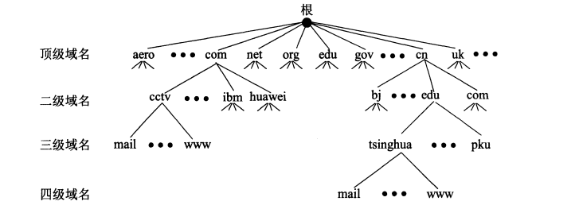
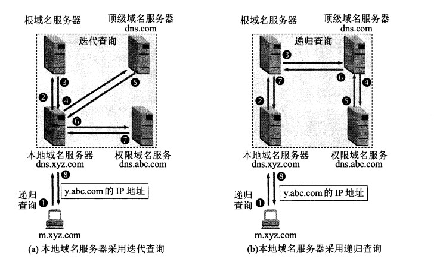

## 计算机网络体系结构

1. 五层协议体系结构
    * 应 用 层：为特定应用提供数据传输服务，数据单位是报文。常见应用层协议有http和dns。
    * 运 输 层：提供的是进程间的通用数据传输服务。由于应用层协议很多，定义通用的运输层协议就可以支持不断增多的应用层协议。运输层包括两种协议：传输控制协议 TCP，提供面向连接、可靠的数据传输服务，数据单位为报文段；用户数据报协议 UDP，提供无连接、尽最大努力的数据传输服务，数据单位为用户数据报。TCP 主要提供完整性服务，UDP 主要提供及时性服务。
    * 网 络 层：为主机之间提供服务，而不是像运输层协议那样是为主机中的进程提供服务。网络层把运输层产生的报文段或者用户数据报封装成分组来进行传输。
    * 数据链路层：网络层针对的还是主机之间，而主机之间可以有很多链路，链路层协议就是为相邻结点之间提供服务。数据链路层把网络层传来的分组封装成帧。
    * 物 理 层：考虑的是怎样在传输媒体上传输数据比特流，而不是指具体的传输媒体。物理层的作用是尽可能屏蔽传输媒体和通信手段的差异，使物理层上的数据链路层感觉不到这些差异。
2. TCP/IP协议族体系结构：它只有四层，相当于五层协议中数据链路层和物理层合并为网络接口层，现在的 TCP/IP 体系结构不严格遵循 OSI 分层概念，应用层可能会直接使用 IP 层或者网络接口层。
    * 应 用 层：
    * 运 输 层：
    * 网 际 层：
    * 网络接口层：

## 物理层：模拟信号是连续的信号，数字信号是离散的信号。带通调制把数字信号转换为模拟信号。

## 数据链路层

1. 封装成帧：将网络层传下来的分组添加首部和尾部封装成帧，用于标记帧的开始和结束。
2. 透明传输：帧中有首部和尾部，如果帧的数据部分含有和首部尾部相同的内容，那么帧的开始和结束位置就会被错误的判定。需要在数据中出现首部尾部相同的内容前面插入转义字符，如果需要传输的内容正好就是转义字符，那么就在转义字符前面再加个转义字符，在接收端进行处理之后可以还原出原始数据。这个过程透明传输的内容是转义字符，用户察觉不到转义字符的存在。
3. 差错检测：目前数据链路层广泛使用了循环冗余检验（CRC）来检查比特差错。除了 CRC，还有：
    * 奇偶校验：添加 1 位使 1 的位数为奇数或偶数，更进一步的二维奇偶校验方法，不但可以检错还可以纠错部分错误
    * 检验和方法：具体参考 UDP 检验和计算方法
4. 互联网用户通常需要连接到某个 ISP 之后才能接入到互联网，PPP 协议就是用户计算机和 ISP 进行通信时所使用的数据链路层协议。
5. 在广播信道上，同一时间只能允许一台计算机发送数据。
    * 多点接入：说明这是总线型网络，许多计算机以多点的方式连接到总线上。
    * 载波监听：每个站都必须不停地检听信道。在发送前，如果检听信道正在使用，就必须等待。
    * 碰撞检测：在发送中，如果检听信道已有其它站正在发送数据，就表示发生了碰撞。虽然每一个站在发送数据之前都已经检听信道为空闲，但是由于电磁波的传播时延的存在，还是有可能会发生碰撞。

## 网络层
1. 因为网络层是整个互联网的核心，因此应当让网络层尽可能简单。网络层向上只提供简单灵活的、无连接的、尽最大努力交互的数据报服务。使用 IP 协议，可以把异构的物理网络连接起来，使得在网络层看起来好像是一个统一的网络。
2. 地址解析协议 ARP:实现由 IP 地址得到 MAC 地址。每个主机都有一个 ARP 高速缓存，存放映射表。如果一个 IP 地址到 MAC 地址的映射不在该表中，主机通过广播的方式发送 ARP 请求分组，匹配 IP 地址的主机会发送 ARP 响应分组告知其 MAC 地址。
3. 交换机与路由器的区别
    * 交换机工作于数据链路层，能识别 MAC 地址，根据 MAC 地址转发链路层数据帧。具有自学机制来维护 IP 地址与 MAC 地址的映射
    * 路由器位于网络层，能识别 IP 地址并根据 IP 地址转发分组。维护着路由表，根据路由表选择最佳路线。
4. 路由器分组转发流程
    * 从数据报的首部提取目的主机的 IP 地址 D，得到目的网络地址 N。（路由表项是网络号而不是 IP 地址，这样做大大减少了路由表条目数量）
    * 若 N 就是与此路由器直接相连的某个网络地址，则进行直接交付；
    * 若路由表中有目的地址为 D 的特定主机路由，则把数据报传送给表中所指明的下一跳路由器；
    * 若路由表中有到达网络 N 的路由，则把数据报传送给路由表中所指明的下一跳路由器；
    * 若路由表中有一个默认路由，则把数据报传送给路由表中所指明的默认路由器；
    * 报告转发分组出错。

## 运输层

1. 网络层只把分组发送到目的主机，但是真正通信的并不是主机而是主机中的进程。运输层提供了应用进程间的逻辑通信。运输层向高层用户屏蔽了下面网络层的核心细节，使应用程序看见的好像在两个运输层实体之间有一条端到端的逻辑通信信道。
2. UDP 和 TCP 的特点
    * 用户数据包协议 UDP（User Datagram Protocol）是无连接的，尽最大可能交付，没有拥塞控制，面向报文（对于应用程序传下来的报文不合并也不拆分，只是添加 UDP 首部）。
    * 传输控制协议 TCP（Transmission Control Protocol） 是面向连接的，提供可靠交付，有流量控制，拥塞控制，提供全双工通信，面向字节流（把应用层传下来的报文看成字节流，把字节流组织成大小不等的数据块）
3. TCP 的三次握手
    1. 首先 B 处于 LISTEN（监听）状态，等待客户的连接请求。
    2. A 向 B 发送连接请求报文段，SYN=1，ACK=0，选择一个初始的序号 x。
    3. B 收到连接请求报文段，如果同意建立连接，则向 A 发送连接确认报文段，SYN=1，ACK=1，确认号为 x+1，同时也选择一个初始的序号 y。
    4. A 收到 B 的连接确认报文段后，还要向 B 发出确认，确认号为 y+1，序号为 x+1。
    5. B 收到 A 的确认后，连接建立。
3. TCP 的四次挥手
    1. A 发送连接释放报文段，FIN=1；
    2. B 收到之后发出确认，此时 TCP 属于半关闭状态，B 能向 A 发送数据但是 A 不能向 B 发送数据；
    3. 当 B 要不再需要连接时，发送连接释放请求报文段，FIN=1；
    4. A 收到后发出确认，此时连接释放。
4. TIME_WAIT: 客户端接收到服务器端的 FIN 报文后进入此状态，此时并不是直接进入 CLOSED 状态，还需要等待一个时间计时器设置的时间。这么做有两个理由：
    1. 确保最后一个确认报文段能够到达。如果 B 没收到 A 发送来的确认报文段，那么就会重新发送连接释放请求报文段，A 等待一段时间就是为了处理这种情况的发生。
    2. 可能存在“已失效的连接请求报文段”，为了防止这种报文段出现在本次连接之外，需要等待一段时间。
5. TCP 滑动窗口
    > 窗口是缓存的一部分，用来暂时存放字节流。发送方和接收方各有一个窗口，接收方通过 TCP 报文段中的窗口字段告诉发送方自己的窗口大小，发送方根据这个值和其它信息设置自己的窗口大小。

    > 发送窗口内的字节都允许被发送，接收窗口内的字节都允许被接收。如果发送窗口左部的字节已经发送并且收到了确认，那么就将发送窗口向右滑动一定距离，直到左部第一个字节不是已发送并且已确认的状态；接收窗口的滑动类似，接收窗口左部字节已经发送确认并交付主机，就向右滑动接收窗口。

    > 接收窗口只会对窗口内最后一个按序到达的字节进行确认，例如接收窗口已经收到的字节为 {31, 32, 34, 35}，其中 {31, 32} 按序到达，而 {34, 35} 就不是，因此只对字节 32 进行确认。发送方得到一个字节的确认之后，就知道这个字节之前的所有字节都已经被接收。
6. TCP 可靠传输:TCP 使用超时重传来实现可靠传输：如果一个已经发送的报文段在超时时间内没有收到确认，那么就重传这个报文段。
7. TCP 流量控制:流量控制是为了控制发送方发送速率，保证接收方来得及接收。接收方发送的确认报文中的窗口字段可以用来控制发送方窗口大小，从而影响发送方的发送速率。例如将窗口字段设置为 0，则发送方不能发送数据。
7. TCP 拥塞控制:如果网络出现拥塞，分组将会丢失，此时发送方会继续重传，从而导致网络拥塞程度更高。因此当出现拥塞时，应当控制发送方的速率。这一点和流量控制很像，但是出发点不同。流量控制是为了让接收方能来得及接受，而拥塞控制是为了降低整个网络的拥塞程度。
    > TCP 主要通过四种算法来进行拥塞控制：慢开始、拥塞避免、快重传、快恢复。发送方需要维护有一个叫做拥塞窗口（cwnd）的状态变量。注意拥塞窗口与发送方窗口的区别，拥塞窗口只是一个状态变量，实际决定发送方能发送多少数据的是发送方窗口。
    1. 为了便于讨论，做如下假设：
        * 接收方有足够大的接收缓存，因此不会发生流量控制；
        * 虽然 TCP 的窗口基于字节，但是这里设窗口的大小单位为报文段。
    > 慢开始与拥塞避免:
    > 1. 发送的最初执行慢开始，令 cwnd=1，发送方只能发送 1 个报文段；当收到确认后，将 cwnd 加倍，因此之后发送方能够发送的报文段为：2、4、8 ...
    > 2. 注意到慢开始每个轮次都将 cwnd 加倍，这样会让 cwnd 增长速度非常快，从而使得发送方发送的速度增长速度过快，网络拥塞的可能也就更高。设置一个慢开始门限 ssthresh，当 cwnd >= ssthresh 时，进入拥塞避免，每个轮次只将 cwnd 加 1。
    > 3. 如果出现了超时，则令 ssthresh = cwnd / 2，然后重新执行慢开始。

    > 快重传与快恢复:
    > 1. 在接收方，要求每次接收到报文段都应该发送对已收到有序报文段的确认，例如已经接收到 M1 和 M2，此时收到 M4，应当发送对 M2 的确认。
    > 2. 注意到慢开始每个轮次都将 cwnd 加倍，这样会让 cwnd 增长速度非常快，从而使得发送方发送的速度增长速度过快，网络拥塞的可能也就更高。设置一个慢开始门限 ssthresh，当 cwnd >= ssthresh 时，进入拥塞避免，每个轮次只将 cwnd 加 1。
    > 3. 如果出现了超时，则令 ssthresh = cwnd / 2，然后重新执行慢开始。

## 应用层
1. 层次结构：一个域名由多个层次构成，从上层到下层分别为顶级域名、二级域名、三级域名以及四级域名。所有域名可以画成一颗域名树。

    
2. 解析过程
> 主机向本地域名服务器解析的过程采用递归，而本地域名服务器向其它域名服务器解析可以使用递归和迭代两种方式。

> 迭代的方式下，本地域名服务器向一个域名服务器解析请求解析之后，结果返回到本地域名服务器，然后本地域名服务器继续向其它域名服务器请求解析；而递归地方式下，结果不是直接返回的，而是继续向前请求解析，最后的结果才会返回。

3. 文件传输协议 FTP：FTP 在运输层使用 TCP，并且需要建立两个并行的 TCP 连接：控制连接和数据连接。控制连接在整个会话期间一直保持打开，而数据连接在数据传送完毕之后就关闭。控制连接使用端口号 21，数据连接使用端口号 20。
4. Web 页面请求过程
    * 向 DNS 服务器发送 DNS 查询报文来解析域名。
    * 开始进行 HTTP 会话，需要先建立 TCP 连接。
    * 在运输层的传输过程中，HTTP 报文被封装进 TCP 中。HTTP 请求报文使用端口号 80，因为服务器监听的是 80 端口。连接建立之后，服务器会随机分配一个端口号给特定的客户端，之后的 TCP 传输都是用这个分配的端口号。
    * 在网络层的传输过程中，TCP 报文段会被封装进 IP 分组中，IP 分组经过路由选择，最后到达目的地。
    * 在链路层，IP 分组会被封装进 MAC 帧中，IP 地址解析成 MAC 地址需要使用 ARP。
    * 客户端发送 HTTP 请求报文，请求获取页面。
    * 服务器发送 HTTP 相应报文，客户端从而获取该页面。
    * 浏览器得到页面内容之后，解析并渲染，向用户展示页面。

## Cookie

> HTTP 协议是无状态的，主要是为了让 HTTP 协议尽可能简单，使得它能够处理大量事务。HTTP/1.1 引入 Cookie 来保存状态信息。

> 服务器发送的响应报文包含 Set-Cookie 字段，客户端得到响应报文后把 Cookie 内容保存到浏览器中。下次再发送请求时，从浏览器中读出 Cookie 值，在请求报文中包含 Cookie 字段，这样服务器就知道客户端的状态信息了。Cookie 状态信息保存在客户端浏览器中，而不是服务器上。

1. Session 和 Cookie 区别:Session 是服务器用来跟踪用户的一种手段，每个 Session 都有一个唯一标识：Session ID。当服务器创建了一个 Session 时，给客户端发送的响应报文就包含了 Set-Cookie 字段，其中有一个名为 sid 的键值对，这个键值对就是 Session ID。客户端收到后就把 Cookie 保存在浏览器中，并且之后发送的请求报文都包含 Session ID。HTTP 就是通过 Session 和 Cookie 这两种方式一起合作来实现跟踪用户状态的，Session 用于服务器端，Cookie 用于客户端。
2. 持久连接: 当浏览器访问一个包含多张图片的 HTML 页面时，除了请求访问 HTML 页面资源，还会请求图片资源，如果每进行一次 HTTP 通信就要断开一次 TCP 连接，连接建立和断开的开销会很大。持久连接 只需要进行一次 TCP 连接就能进行多次 HTTP 通信。HTTP/1.1 开始，所有的连接默认都是持久连接。持久连接需要使用 Connection 首部字段进行管理。HTTP/1.1 开始 HTTP 默认是持久化连接的，如果要断开 TCP 连接，需要由客户端或者服务器端提出断开，使用 Connection: close；而在 HTTP/1.1 之前默认是非持久化连接的，如果要维持持续连接，需要使用 Keep-Alive。
3. http安全性问题
    * 通信使用明文，内容可能会被窃听；
    * 不验证通信方的身份，因此有可能遭遇伪装；
    * 无法证明报文的完整性，所以有可能已遭篡改。
    > HTTPs 并不是新协议，而是 HTTP 先和 SSL（Secure Socket Layer）通信，再由 SSL 和 TCP 通信。通过使用 SSL，HTTPs 提供了加密、认证和完整性保护。
4. 加密：
    > 有两种加密方式：对称密钥加密和公开密钥加密。对称密钥加密的加密和解密使用同一密钥，而公开密钥加密使用一对密钥用于加密和解密，分别为公开密钥和私有密钥。公开密钥所有人都可以获得，通信发送方获得接收方的公开密钥之后，就可以使用公开密钥进行加密，接收方收到通信内容后使用私有密钥解密。

    > 对称密钥加密的缺点：无法安全传输密钥；公开密钥加密的缺点：相对来说更耗时。

    > HTTPs 采用 混合的加密机制，使用公开密钥加密用于传输对称密钥，之后使用对称密钥加密进行通信。（下图中，共享密钥即对称密钥）

    1. 对称加密： 所谓对称加密，就是它们在编码时使用的密钥e和解码时一样d(e=d)，我们就将其统称为密钥k。对称加解密的过程如下：
        * 发送端和接收端首先要共享相同的密钥k(即通信前双方都需要知道对应的密钥)才能进行通信。发送端用共享密钥k对明文p进行加密，得到密文c，并将得到的密文发送给接收端，接收端收到密文后，并用其相同的共享密钥k对密文进行解密，得出明文p。
        * 一般加密和解密的算法是公开的，需要保持隐秘的是密钥k，流行的对称加密算法有：DES，Triple-DES，RC2和RC4
        * 另外一个点需要重点说明的是，密钥k的长度对解密破解的难度有很重大的影响，k的长度越长，对应的密码空间就越大，遭到暴力破解或者词典破解的难度就更大，就更加安全。
        * 不足：
            1. 发送方和接收方首先需要共享相同的密钥，即存在密钥k的分发问题，如何安全的把共享密钥在双方进行分享，这本身也是一个如何安全通信的问题，一种方法是提前双方约定好，不通过具体的通信进行协商，避免被监听和截获。另外一种方式，将是下面我们介绍的通过非对称加密信道进行对称密码的分发和共享，即混合加密系统。
            2. 密钥管理的复杂度问题。由于对称加密的密钥是一对一的使用方式，若一方要跟n方通信，则需要维护n对密钥。
        * 好处：
            1. 加密和解密的速度要比非对称加密快很多，因此常用非对称加密建立的安全信道进行共享密钥的分享，完成后，具体的加解密则使用对称加密。即混合加密系统。
    2. 非对称加密： 所谓非对称加密技术是指加密的密钥e和解密的密钥d是不同的（e!=d），并且加密的密钥e是公开的，叫做公钥，而解密的密钥d是保密的，叫私钥。非对称加解密的过程如下：
        * 加密一方找到接收方的公钥e(如何找到呢？大部分的公钥查找工作实际上都是通过数字证书来实现的)，然后用公钥e对明文p进行加密后得到密文c，并将得到的密文发送给接收方，接收方收到密文后，用自己保留的私钥d进行解密，得到明文p，需要注意的是：用公钥加密的密文，只有拥有私钥的一方才能解密，这样就可以解决加密的各方可以统一使用一个公钥即可。
        * 常用的非对称加密算法有：RSA
            * 另外一个点需要重点说明的是，密钥k的长度对解密破解的难度有很重大的影响，k的长度越长，对应的密码空间就越大，遭到暴力破解或者词典破解的难度就更大，就更加安全。
            * 不足：
                1. 加解密的速度没有对称加密快
            * 好处：
                1. 不存在密钥分发的问题，解码方可以自己生成密钥对，一个做私钥存起来，另外一个作为公钥进行发布。
                2. 解决了密钥管理的复杂度问题，多个加密方都可以使用一个已知的公钥进行加密，但只有拥有私钥的一方才能解密。

    > 综上，分析了对称加密和非对称加密各自的优缺点后，有没有一种办法是可以利用两者的优点但避开对应的缺点呢？答应是有的，实际上用得最多的是混合加密系统，比如在两个节点间通过便捷的公开密码加密技术建立起安全通信，然后再用安全的通信产生并发送临时的随机对称密钥，通过更快的对称加密技术对剩余的数据进行加密。

5. 认证：
    > 通过使用 证书 来对通信方进行认证。证书中有公开密钥数据，如果可以验证公开密钥的确属于通信方的，那么就可以确定通信方是可靠的。

    > 数字证书认证机构（CA，Certificate Authority）颁发的公开密钥证书，可以通过 CA 对其进行验证。

    > 进行 HTTPs 通信时，服务器会把证书发送给客户端，客户端取得其中的公开密钥之后，就可以开始加密过程。

    > 使用 OpenSSL 这套开源程序，每个人都可以构建一套属于自己的认证机构，从而自己给自己颁发服务器证书。浏览器在访问该服务器时，会显示“无法确认连接安全性”或“该网站的安全证书存在问题”等警告消息。

    > 客户端证书需要用户自行安装，只有在业务需要非常高的安全性时才使用客户端证书，例如网上银行。
6. SSL协议通信过程
    1. 浏览器发送一个连接请求给服务器;服务器将自己的证书(包含服务器公钥S_PuKey)、对称加密算法种类及其他相关信息返回客户端;
    2. 客户端浏览器检查服务器传送到CA证书是否由自己信赖的CA中心签发。若是，执行4步;否则，给客户一个警告信息：询问是否继续访问。
    3. 客户端浏览器比较证书里的信息，如证书有效期、服务器域名和公钥S_PK，与服务器传回的信息是否一致，如果一致，则浏览器完成对服务器的身份认证。
    4. 服务器要求客户端发送客户端证书(包含客户端公钥C_PuKey)、支持的对称加密方案及其他相关信息。收到后，服务器进行相同的身份认证，若没有通过验证，则拒绝连接;
    5. 服务器根据客户端浏览器发送到密码种类，选择一种加密程度最高的方案，用客户端公钥C_PuKey加密后通知到浏览器;
    6. 客户端通过私钥C_PrKey解密后，得知服务器选择的加密方案，并选择一个通话密钥key，接着用服务器公钥S_PuKey加密后发送给服务器;
    7. 服务器接收到的浏览器传送到消息，用私钥S_PrKey解密，获得通话密钥key。
    8. 接下来的数据传输都使用该对称密钥key进行加密。

